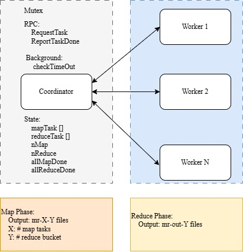

# Objective

Implement a fault-tolerant MapReduce framework:
* Coordinator
* Workers
* RPC communication
* Task scheduling
* Intermediate file generation
* Fault recovery through task re-assignment

# Overall Architecture



# Coordinator

## Coordinator State
The coordinator maintains:
```
Mutex
mapTasks []Task 
reduceTasks []Task 
nMap 
nReduce 
allMapTaskComplete 
allReduceTaskComplete
```

Each task records:
```
State
StartTime
FileName (map only)
```

Task State:
```
Idle
InProgress
Completed
```

## Coordinator Task Scheduling Logic
During map phase:

```
- Any Idle map task?  
- if Yes Assign it 
- Otherwise Wait
```

During reduce phase:
```
- All maps complete?
- Yes. Assign Idle reduce tasks
```

Once all reduce tasks complete, the coordinate can Exit.

## Coordinator Fault Tolerance
Coordinator launches a background goroutine:

```go
go checkTimeout()

// for every second
// scan over all map tasks and reduce tasks
// for the task whose state is in progress
// count the running duration
// if >= 10 seconds, change the task state to Idle 
```

## Coordinator Mutex
Coordinator state is shared among all different workers, so we need to add a mutex for every possible concurrent access.
```go
coordinator.mu.Lock()

coordinator.mu.Unlock()
```

# Worker Execution Loop
Each worker continuously performs:
```
RequestTask() -> switch(TaskType) -> Map Reduce Wait Exit -> ReportTaskDone()
```

# RPC Design
Two RPC designs are required:
## RequestTask
Worker requests new work and the RPC message can be empty.

Coordinator replies with:
```
task type
task id
filename (map only)
NReduce
NMap
```

Possible task types:
```
Map
Reduce
Wait
Exit
```

## ReportTask
Worker informs the coordinator that a task completed successfully.

Coordinator updates task state

# Map Phase
Each map task processes one input file.
```
read file -> mapf() -> []KeyValue -> partition using ihash(key) % NReduce -> write JSON intermediate files
```

Intermediate file names follow:
```
mr-X-Y

X = map task id 
Y = reduce partition
```

# Reduce Phase
Each reduce worker processes one partition.
```
for map task X -> read mr-X-Y -> decode JSON -> collect KeyValues -> sort by key -> group identical keys -> reducef() -> write mr-out-Y
```

# Implementation Plan
- Define RPC messages.
- Implement coordinator task state.
- Implement worker request loop.
- Implement map execution.
- Implement reduce execution.
- Implement task scheduling.
- Implement completion reporting.
- Add atomic output.
- Add timeout recovery.
- Pass sequential correctness.
- Pass parallel tests.
- Pass crash recovery tests.